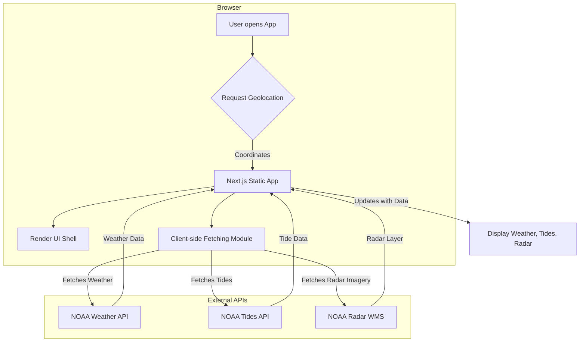

# Boating Forecast PWA - App Creation Prompt

Below is a comprehensive prompt that can be used (e.g., in Lovable, Cursor, or other AI coding assistants) to recreate this entire application from scratch based on its current state.

***

**System Role & Objective**
Act as an expert software engineer and create a comprehensive "Boating Forecast" Progressive Web App (PWA). The app provides boaters with localized weather forecasts, wave heights, tide charts, and an interactive radar map based on their current GPS location.

**Tech Stack**
- Framework: Next.js (App Router, static export mode `output: 'export'`)
- Language: React 19, JavaScript (ESM only)
- Styling: Tailwind CSS
- PWA Integration: `next-pwa`
- Mapping: `react-leaflet`, `leaflet`
- Charting: `react-chartjs-2`, `chart.js`
- Testing: Jest (unit/integration), Playwright (E2E)

**Architecture & PWA Requirements**
1. Ensure the Next.js app is configured for static export in `next.config.mjs` (`output: 'export'`). Disable image optimization for static export (`images: { unoptimized: true }`).
2. Integrate `next-pwa` in `next.config.mjs` to cache the static assets in `public/` and automatically register the service worker (`dest: 'public'`, `register: true`, `skipWaiting: true`).
3. Add a `public/manifest.json` defining standard PWA properties (name, short_name, icons, display: 'standalone', background_color, theme_color).
4. The main entry (`app/page.js`) should mount a client-side component `WeatherDashboard`. All logic relying on `navigator.geolocation` or `window` must be client-side only (using `"use client"`).

**Core Features & Components**
- **WeatherDashboard (`components/WeatherDashboard.js`)**: Orchestrates the fetching of data. When loaded, checks `navigator.onLine`. If offline, show an offline message. If online, use `navigator.geolocation.getCurrentPosition` to get latitude and longitude. Shows loading state.
- **NWS Forecast**: Display the current location and current detailed forecast text for the day from the NWS API.
- **Wave Forecast (`components/WaveForecast.js`)**: Create a component that receives the detailed NWS forecast string, parses it, and displays the wave heights using a regex: `/(?:seas|waves) (?:around )?(\d+)(?: to (\d+))?/i`.
- **Tide Chart (`components/TideChart.js`)**: Render a line chart using `react-chartjs-2`. Display tide predictions for the day on a smooth line chart with time as the X-axis and height as the Y-axis.
- **Radar Map (`components/RadarMap.js` & `components/DynamicRadarMap.js`)**: Use Leaflet to display a map centered on the user's location. Add a WMS tile layer from NOAA's radar service (`https://opengeo.ncep.noaa.gov/geoserver/MRMS/wms`, layer `"CREF"`). Must be dynamically imported with `ssr: false` in Next.js to avoid window undefined errors on the server side.

**Data Service layer (`lib/weatherService.js`)**
Create functions to handle external data fetching. All fetch requests must handle errors appropriately.
1. `getNWSForecast(lat, lon)`:
   - Call `https://api.weather.gov/points/{lat},{lon}`.
   - Use the `properties.forecast` URL from the response to fetch the actual forecast.
   - You MUST include a `User-Agent` header for all NWS requests: `CanIGoBoatingToday/1.0 (canigoboatingtoday.com, hello@canigoboatingtoday.com)`.
2. `getTideData(lat, lon)`:
   - Needs to find the closest NOAA tide station first.
   - Fetch the full list of tide stations from `https://api.tidesandcurrents.noaa.gov/mdapi/prod/webapi/stations.json?type=tidepredictions`. Cache this list in `localStorage` for 7 days to avoid repeated network calls.
   - Iterate through the stations and use the Haversine formula to find the closest one to the user's lat/lon. (Optimize the formula by pre-calculating the user's lat/lon in radians).
   - Once the nearest station ID is found, fetch the tide predictions for the current day (YYYYMMDD format) using: `https://api.tidesandcurrents.noaa.gov/api/prod/datagetter?begin_date={date}&end_date={date}&station={stationId}&product=predictions&datum=MLLW&time_zone=lst_ldt&units=english&format=json`.

**Utility Module (`lib/locationUtils.js`)**
Include math functions required:
- `deg2rad(deg)`: Converts degrees to radians.
- `getHaversineDistanceOptimized(lat1Rad, lon1Rad, cosLat1, lat2, lon2)`: Optimized Haversine distance where the origin's coordinates are pre-computed.
- `isValidCoordinate(lat, lon)`: Ensure coordinates are finite numbers and within bounds (-90 to 90 for lat, -180 to 180 for lon).

**Mermaid Architecture Diagram**
Please incorporate the following architecture diagram logically into the application documentation (`TECHNICAL_DESIGN.md`):

Build the files following standard, clean, modular ES6 practices.

**UI / UX Design**
- **Layout & Structure:** Use a responsive, mobile-first design centered on the screen (`flex flex-col items-center p-24` in Next.js `main`). The `WeatherDashboard` should have a max width (`max-w-4xl`) and space out its children vertically (`space-y-8`).
- **Cards:** Display the Current Conditions, Wave Forecast, Tide Chart, and Weather Radar within distinct "card" components. Each card should use Tailwind classes: `p-6` or `p-4` for padding, `border` for subtle outlines, `rounded-lg` for rounded corners, `bg-white` for background, and `shadow-md` to lift them from the background.
- **Typography:**
  - App Title: `text-3xl font-bold text-center mb-6`
  - Section Headings: `text-2xl font-semibold mb-4`
  - Body Text: `text-lg` or `text-xl`
  - Emphasis: Use `font-semibold` for labels (e.g., "Latitude:", "Current Wave Height:").
- **Colors:** Use Tailwind's default color palette. Use `text-red-500` for error states, and standard text colors for the default theme. The PWA theme color should be `#007bff`.
- **Loading & Error States:** Ensure loading states and error messages are centered and clearly visible to the user (`text-center p-8`).
