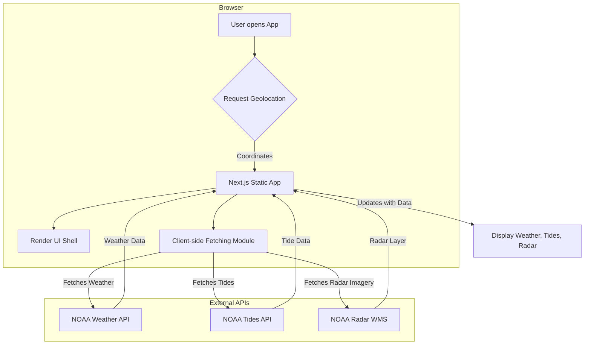

# Technical Design Document: Boating Forecast PWA

*Note: If you are looking for a comprehensive prompt to recreate this application from scratch using an AI coding assistant, please see **[App Creation Prompt](docs/PROMPT.md)**.*

## 1. Project Goals & Features

### 1.1. Vision

To create a robust, maintainable, and production-ready Progressive Web App (PWA) that provides boaters with a comprehensive and easy-to-understand weather forecast. The application will be designed with a mobile-first approach, be installable on user devices, and function offline. It will be built as a static site, suitable for hosting on platforms like GitHub Pages, Vercel, or Netlify.

### 1.2. Core Features

- **Location-Aware Forecasts:** Automatically fetch and display weather data based on the user's current GPS location.
- **Tide Charts:** Display a graphical representation of high and low tides for the user's location.
- **Wave Height Data:** Show current and forecasted wave heights.
- **Weather Radar:** Provide an interactive map displaying live radar imagery from NOAA.
- **Responsive Design:** Ensure a seamless user experience across desktop and mobile devices.
- **PWA Functionality:** The application must be installable on iOS and Android and provide a basic offline experience (e.g., an "offline" message).

## 2. Architecture

The application will be built as a **static site using Next.js**. This architecture was chosen to meet the requirement of being hostable on static site providers without a traditional backend server.

### 2.1. Static Site Generation (SSG)

The core application shell (the main HTML, CSS, and JavaScript) will be pre-built at build time. This results in extremely fast initial page loads. All dynamic data (weather, tides, etc.) will be fetched client-side after the initial page load.

### 2.2. Client-Side Data Fetching

Upon loading, the application will:
1.  Request the user's geolocation via the browser's Geolocation API.
2.  Use the coordinates to make direct API calls to the necessary services (NOAA, etc.) from the client.
3.  Process and display the fetched data in the UI.

This approach avoids the need for a backend but has known trade-offs, which are addressed in the "Future Considerations" section.

### 2.3. Progressive Web App (PWA)

We will implement PWA features to allow for installation and offline support. A service worker will be configured to cache the main application assets. When the user is offline, the service worker will intercept network requests and serve the cached application shell, which will then display a clear "You are offline" message.

### 2.4. Architecture Diagram (Mermaid)

## 3. Technology Stack

- **Framework:** Next.js 13+ with React 18+ (using the App Router)
- **Styling:** Tailwind CSS
- **State Management:** React Context API (for managing global state like user location)
- **Mapping:** Leaflet.js (for the interactive radar map)
- **Charting:** Chart.js (for tide charts)
- **Unit & Integration Testing:** Jest with React Testing Library
- **End-to-End (E2E) Testing:** Playwright
- **Package Manager:** `npm`

## 4. Component Breakdown

The UI will be built from a set of reusable React components.

- **/app/page.js:** The main entry point of the application.
- **/components/WeatherDashboard.js:** The primary component that orchestrates the fetching and display of all weather-related data.
- **/components/LocationBar.js:** Displays the user's current location and allows for manual search (future enhancement).
- **/components/CurrentConditions.js:** Shows the current weather (temperature, wind, etc.).
- **/components/TideChart.js:** A Chart.js component to render tide prediction data.
- **/components/WaveForecast.js:** Displays wave height information.
- **/components/RadarMap.js:** A Leaflet.js component that integrates with the NOAA WMS service to show radar imagery.
- **/components/LoadingSpinner.js:** A reusable loading indicator.
- **/components/ErrorMessage.js:** A component to display errors from API calls.

## 5. Data Flow

1.  **Initialization:** The `WeatherDashboard` component mounts. It requests the user's location.
2.  **State Update:** The user's coordinates are stored in a global React context.
3.  **Data Fetching:** A centralized `weatherService.js` module contains all the logic for fetching data from external APIs. Components that need data will call functions from this service.
4.  **Rendering:** As data is fetched, the respective components (e.g., `TideChart`, `WaveForecast`) re-render to display it. Loading and error states are handled explicitly.

## 6. Future Considerations

### 6.1. Migrating to a Serverless Backend

The purely client-side approach for data fetching presents two main challenges for a production-grade application:

1.  **Performance:** Fetching and processing large datasets (like the full list of NOAA tide stations) on the client can be slow and resource-intensive.
2.  **Security:** API keys, if required, would be exposed in the client-side code, which is a significant security risk.

To address this, the architecture is designed for a seamless future migration to a serverless model using **Next.js API Routes** or a similar serverless function provider (Netlify Functions, Vercel Functions).

The migration path would be:
1.  Move the data-fetching logic from the client-side `weatherService.js` to API routes (e.g., `/api/weather`, `/api/tides`).
2.  These serverless functions would run in a Node.js environment, allowing them to securely store API keys and perform heavy data processing (like finding the nearest tide station) before sending a minimal, clean dataset to the client.
3.  The client-side code would then be updated to call these internal API routes instead of the external NOAA APIs directly.

This phased approach allows us to meet the initial requirement of a static site while paving a clear, scalable path forward.
